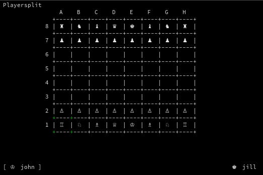

# ssh-chess
ssh-chess is a chess server that runs through the SSH protocol

## Getting Started
1. Clone this project and `cd` into it
2. Run `ssh-keygen -t rsa -f id_rsa` to create a RSA public/private keypair in the current directory for the server to use. Do not give it a passphrase
3. Run `go get -v -d ./...`
4. Run `PORT=2022 go run cmd/ssh-chess/main.go` the ssh server should be running on port `2022` 
5. Run `ssh <username>@localhost -p 2022` to play chess in a random room

## Connecting to Rooms
- Running `ssh <username>@server -p 2022` will connect a user to a random room
- Running `ssh <username>#<room-name>@server -p 2022` will connect a user to a named room - use this if you want to play a specific user by giving that user the `room-name` 

